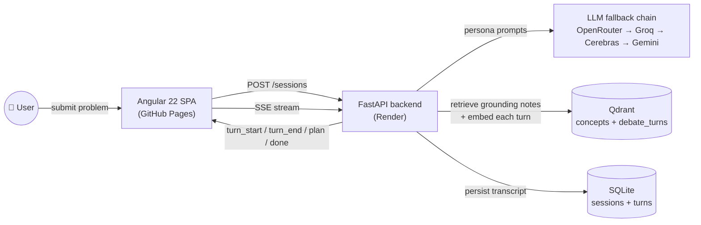

<div align="center">

# 🏟️ System Design Arena

### Watch six AI agents debate your system design — live, streaming, and grounded in retrieval.

**An open-source multi-agent LLM playground:** submit a system design problem and watch a **Proposer, Constraints, Performance, Security, Critic, and Moderator** agent argue it out in real time over Server-Sent Events, retrieve grounding notes from a vector database before they speak, explicitly rebut each other by quoting prior turns, and converge on a downloadable architecture decision record.

[**🚀 Live Demo**](https://ashikvarma11.github.io/system-design-arena/) · [Report a Bug](https://github.com/ashikvarma11/system-design-arena/issues) · [Request a Feature](https://github.com/ashikvarma11/system-design-arena/issues) · [Contributing](CONTRIBUTING.md)

[](https://ashikvarma11.github.io/system-design-arena/)
[](LICENSE)
[](backend)
[](frontend)
[](https://qdrant.tech/)
[](CONTRIBUTING.md)

</div>

---

> **Topics:** artificial-intelligence · ai · llm · large-language-models · multi-agent-systems · multi-agent-debate · agentic-ai · ai-agents · genai · generative-ai · rag · retrieval-augmented-generation · vector-database · qdrant · fastapi · angular · server-sent-events · sse-streaming · system-design · software-architecture · llm-orchestration · openrouter · groq · gemini · cerebras

## 🎥 Live Demo

**Frontend:** [ashikvarma11.github.io/system-design-arena](https://ashikvarma11.github.io/system-design-arena/)
**API:** [system-design-arena-w5rk.onrender.com](https://system-design-arena-w5rk.onrender.com)

> ⏳ **Heads up:** the backend runs on Render's free tier, which spins down after periods of inactivity. Your **first request may take ~30–50 seconds** to wake it up. Subsequent requests are fast. This is a free-tier limitation, not a bug.

## What is this?

Most "AI portfolio" projects are a RAG chatbot wrapped around a PDF. **System Design Arena** is a hand-rolled **multi-agent debate engine**: six LLM personas with distinct system prompts argue about a system design problem, retrieve grounding context from a vector knowledge base *before* they argue (not instead of arguing), explicitly quote and rebut each other, and are forced to converge on a structured, downloadable decision — all streamed to the browser turn-by-turn as it happens.

No LangGraph. No CrewAI. No AutoGen. Just an explicit, inspectable, bounded loop — because in a system that argues with itself, "explicit and impossible to run forever" beats "magic."

## Table of Contents

- [Live Demo](#-live-demo)
- [Features](#features)
- [How It Works](#how-it-works)
- [Architecture](#architecture)
- [Tech Stack](#tech-stack)
- [Getting Started](#getting-started)
- [Environment Variables](#environment-variables)
- [API Reference](#api-reference)
- [Project Structure](#project-structure)
- [Testing](#testing)
- [Roadmap](#roadmap)
- [Contributing](#contributing)
- [License](#license)
- [Acknowledgments](#acknowledgments)

## Features

- 🤖 **Six-persona multi-agent debate** — Proposer/Architect, Constraints, Performance, Security, Critic, and Moderator, each with a distinct system prompt and job.
- 🗣️ **Agents explicitly rebut each other** — the Critic must quote and name a specific prior turn it's attacking; dimension agents can reopen a teammate's fix with `REBUTTING: "..."`. Disagreement is a traceable, renderable fact, not vague prose.
- ⚡ **True real-time streaming** — Server-Sent Events from FastAPI, consumed in Angular via `fetch` + `ReadableStream` for full control over parsing and teardown.
- 📚 **Retrieval-augmented arguments (RAG)** — each dimension agent pulls 2-3 grounding notes from a curated concept knowledge base (CAP theorem, sharding, OWASP categories, and more) *before* it critiques, and re-retrieves every round as the proposal evolves.
- 🧠 **Cross-session semantic recall** — every debate turn ever produced is embedded on write; finished debates automatically surface similar past debates via vector search.
- 📝 **Structured, downloadable output** — the Moderator synthesizes a JSON `AgreedPlan` (decision summary, constraints/performance/security considerations, open risks), exportable as `plan.md`.
- 📎 **Flexible input** — free text or upload a `.txt` / `.md` / `.pdf` describing your design problem.
- 🔁 **Resilient LLM calls** — automatic fallback across four independent free-tier providers (OpenRouter → Groq → Cerebras → Gemini), so one provider's rate limit doesn't stall a debate.
- 💸 **Runs entirely on free tiers** — no paid API keys and no credit card required anywhere in the stack.

## How It Works

1. **Submit a problem** — free text or a file (e.g. *"Design a URL shortener for 1M reads/sec, budget under $500/month"*).
2. **Brief normalization** — an LLM call structures the raw input into a `ProblemBrief` (`goals`, `constraints`, `non_goals`) before any debate starts.
3. **Bounded debate** (2-5 rounds, user-selectable — a fixed loop, never open-ended):
   - **Proposer/Architect** kicks off with an initial architecture.
   - **Constraints**, **Performance**, and **Security** agents react concurrently, each retrieving grounding notes from the concept KB first.
   - **Critic** rebuts exactly one specific prior turn, quoting and naming what it's attacking.
   - **Proposer** revises in response to the round's critiques (except after the final round).
   - After all rounds (or early convergence if every persona signals agreement), **Moderator** synthesizes the final `AgreedPlan`.
4. **Every turn is persisted and embedded** — SQLite for the transcript, Qdrant for semantic search over it.
5. **Download the plan** as Markdown, generated client-side from the already-fetched JSON.
6. **Browse history** — past debates are listed, and related debates are surfaced automatically via vector search.

## Architecture



## Tech Stack

| Layer | Choice | Why |
|---|---|---|
| Backend | Python + FastAPI | Deliberately Python-first, to build AI-engineer-relevant skills. |
| Frontend | Angular 22, standalone components + signals | A real streaming UI, not just forms. |
| LLM providers | OpenRouter → Groq → Cerebras → Gemini, automatic fallback | Four independent free-tier rate-limit buckets behind one `llm_client.py` abstraction — persona code never touches provider specifics. |
| Embeddings | Gemini `gemini-embedding-001` (hosted) | Free tier, no card. Originally local `sentence-transformers`, but that pulled in full PyTorch and blew past Render's 512MB free-tier memory cap — switched to a hosted call. |
| Vector DB | Qdrant (Docker locally / Qdrant Cloud in prod) | Free, unlimited, no account required for local dev. |
| Relational store | SQLite via SQLAlchemy 2.0 | Zero-signup, simple, sufficient for a single-instance deployment. |
| Orchestration | Hand-rolled `run_debate()` generator | No LangGraph/CrewAI/AutoGen — a plain bounded loop that's explicit, inspectable, and impossible to accidentally run forever. |

No heavy agent framework is used on purpose: the debate loop is ~250 lines in [`orchestrator.py`](backend/app/orchestration/orchestrator.py), and every step — who speaks, what they retrieve, what gets persisted — is explicit rather than hidden behind a framework's control flow.

## Getting Started

### Prerequisites

- [Python 3.11+](https://www.python.org/)
- [Node.js 20+](https://nodejs.org/) and npm
- [Docker](https://www.docker.com/) (for running Qdrant locally)
- Free-tier API keys from the providers below (no credit card required for any of them)

### 1. Get your own free API keys

This project runs entirely on free tiers. The live demo uses the author's own free-tier accounts — **you cannot use those**, and no real keys are included anywhere in this repo. Sign up for your own (all free, no card required):

| Provider | Used for | Get a key |
|---|---|---|
| Groq | LLM fallback provider | [console.groq.com](https://console.groq.com/) |
| Google AI Studio | LLM fallback + embeddings (**required**) | [aistudio.google.com](https://aistudio.google.com/) |
| OpenRouter | LLM fallback provider (optional) | [openrouter.ai](https://openrouter.ai/) |
| Cerebras | LLM fallback provider (optional) | [cloud.cerebras.ai](https://cloud.cerebras.ai/) |
| Qdrant Cloud | Vector DB (optional — Docker works for local dev) | [cloud.qdrant.io](https://cloud.qdrant.io/) |

At minimum you need a **Groq** key and a **Gemini** key to run a full debate locally.

### 2. Start Qdrant

```bash
docker compose up -d
```

### 3. Backend setup

```bash
cd backend
python -m venv .venv

# Windows
.venv\Scripts\activate
# macOS/Linux
source .venv/bin/activate

pip install -r requirements.txt
cp .env.example .env   # Windows: copy .env.example .env
```

Open `.env` and fill in your own keys from step 1. **Never commit this file.**

```bash
# Seed the concept knowledge base (76 notes agents retrieve from)
python -m app.retrieval.concept_seeding.seed_concepts

# Run the API
uvicorn app.main:app --reload --port 8000
```

### 4. Frontend setup

```bash
cd frontend
npm install
npm start   # serves on http://localhost:4200
```

### 5. Verify it's working

```bash
curl http://localhost:8000/health

# Create a session (returns a structured ProblemBrief)
curl -X POST http://localhost:8000/api/v1/sessions \
  -H "Content-Type: application/json" \
  -d '{"text": "Design a URL shortener for 1M reads/sec, budget under $500/month.", "rounds_planned": 3}'

# Stream the debate for that session id (SSE: turn_start, turn_end, plan, done, error)
curl -N http://localhost:8000/api/v1/sessions/{id}/stream

# Fetch the full transcript + agreed plan once complete
curl http://localhost:8000/api/v1/sessions/{id}
```

...or just open `http://localhost:4200`, submit a prompt, and watch the transcript stream live.

## Environment Variables

All variables live in `backend/.env` (see [`backend/.env.example`](backend/.env.example) — copy it, never commit your filled-in `.env`).

| Variable | Purpose |
|---|---|
| `OPENROUTER_API_KEY` | LLM fallback provider #1 — free-tier chat completions via OpenRouter. |
| `GROQ_API_KEY` | LLM fallback provider #2 — free-tier chat completions via Groq. |
| `CEREBRAS_API_KEY` | LLM fallback provider #3 — free-tier chat completions via Cerebras. |
| `GEMINI_API_KEY` | LLM fallback provider #4, **and required** for embeddings used by the concept KB and cross-session recall. |
| `DATABASE_URL` | SQLAlchemy connection string for the SQLite transcript store. Defaults to `sqlite:///./data/app.db`. |
| `QDRANT_URL` | URL of your Qdrant instance (local Docker or Qdrant Cloud). |
| `QDRANT_API_KEY` | API key for Qdrant Cloud (leave blank for a local, unauthenticated Docker instance). |
| `CORS_ALLOWED_ORIGINS` | Comma-separated origins the API accepts requests from. Defaults to the Angular dev server. |

## API Reference

| Endpoint | Purpose |
|---|---|
| `POST /api/v1/sessions` | Create a session from free text (`rounds_planned` 2-5, default 3). |
| `POST /api/v1/sessions/upload` | Create a session from an uploaded `.txt` / `.md` / `.pdf`. |
| `GET /api/v1/sessions` | List past sessions. |
| `GET /api/v1/sessions/{id}` | Full transcript + agreed plan for one session. |
| `GET /api/v1/sessions/{id}/stream` | SSE stream of the live debate. Also used to retry a `failed` session. |
| `GET /api/v1/sessions/{id}/related` | Cross-session recall via vector search over past turns. |

## Project Structure

```
system-design-arena/
├── docker-compose.yml              # Qdrant only
├── backend/
│   └── app/
│       ├── api/routes/{sessions,debate}.py
│       ├── core/{llm_client.py, embeddings.py}       # LLM fallback chain + embeddings
│       ├── orchestration/{personas.py, orchestrator.py, events.py}  # the debate loop
│       ├── ingestion/{brief_normalizer.py, file_extractors.py}
│       ├── retrieval/{vector_store.py, concept_seeding/}            # Qdrant
│       ├── persistence/{db.py, models.py, schemas.py}                # SQLite
│       └── services/{session_service.py, debate_service.py}
└── frontend/src/app/
    ├── core/{models/*, services/{session.service.ts, debate-stream.service.ts}}
    ├── features/{problem-input/, debate-arena/, history/}
    └── shared/{persona-badge/, related-sessions/, services/plan-export.service.ts}
```

## Testing

```bash
# Backend
cd backend && pytest

# Frontend
cd frontend && npm test
```

> The test harnesses are wired up (`pytest`, Vitest) but coverage is thin right now — this is a great place for a first contribution. See [Contributing](#contributing).

## Roadmap

- [x] Brief normalization from free text / uploaded files
- [x] Full six-persona debate loop with per-round retrieval
- [x] Angular streaming UI
- [x] Cross-session recall via vector search
- [x] User-selectable round count, retry-on-failure
- [x] Live deployment (GitHub Pages + Render)
- [ ] Backend and frontend test coverage
- [ ] CI pipeline (GitHub Actions)
- [ ] A second "delivery debate" phase — PM / Developer / QA / Architect personas negotiating a shipping timeline off the agreed architecture

## Contributing

Contributions are welcome — bug reports, feature ideas, new personas, tests, and docs fixes all help. See [CONTRIBUTING.md](CONTRIBUTING.md) for setup notes, project conventions, and the PR process.

## License

Distributed under the [MIT License](LICENSE).

## Acknowledgments

This project runs entirely on generous free tiers from:

- [OpenRouter](https://openrouter.ai/), [Groq](https://groq.com/), [Cerebras](https://cerebras.ai/), and [Google Gemini](https://ai.google.dev/) for LLM inference
- [Google Gemini](https://ai.google.dev/) for embeddings
- [Qdrant](https://qdrant.tech/) for vector search
- [Render](https://render.com/) and [GitHub Pages](https://pages.github.com/) for hosting

<div align="center">

If you found this useful, consider giving it a ⭐ — it helps others discover the project.

</div>
